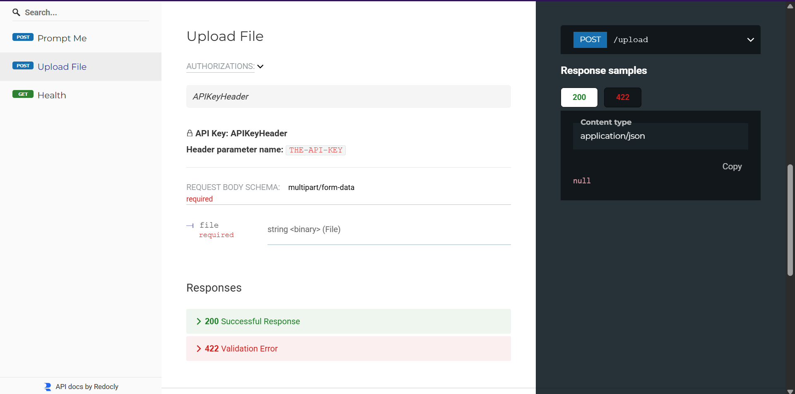
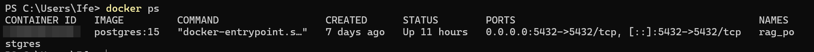
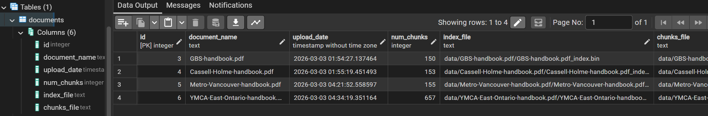
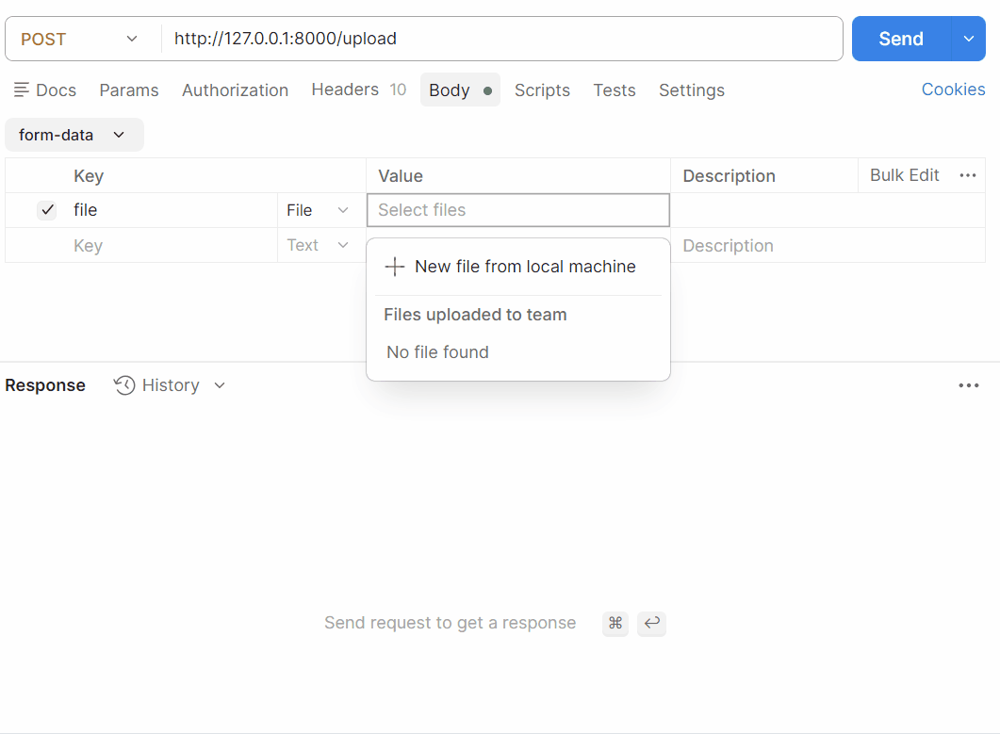

# Multi-Document RAG Backend API

A modular Retrieval-Augmented Generation (RAG) backend for querying internal documents using semantic search.

This system allows multiple PDFs to be uploaded, indexed, and queried through a REST API. Each document generates its own FAISS vector index, and queries are dynamically routed to the correct vector store using metadata stored in PostgreSQL.

The project focuses on backend architecture for AI-powered knowledge systems rather than a simple chatbot demo.

---

## Architecture Overview

```text
                +----------------------+
                |      Client API      |
                |   (HTTP Requests)    |
                +----------+-----------+
                           |
                           v
                 +------------------+
                 |     FastAPI      |
                 |   app.py routes  |
                 +---------+--------+
                           |
          +----------------+----------------+
          |                                 |
          v                                 v
+----------------------+        +--------------------------+
|   PostgreSQL (DB)    |        |    Vector Store (FAISS)  |
|  Document Metadata   |        |  Per-document Indexes    |
| document_name        |        |  *.bin + *.pkl files     |
| index_file_path      |        +--------------------------+
| chunks_file_path     |
+----------+-----------+
           |
           v
 +--------------------------+
 | Retrieval Pipeline       |
 | pipeline.py              |
 |                          |
 | - Embed query            |
 | - Vector similarity      |
 | - Retrieve top-k chunks  |
 | - Send context to LLM    |
 +------------+-------------+
              |
              v
      +------------------+
      |   Local LLM API  |
      |  (Generation)    |
      +------------------+

```

---

## Features

- Multi-document ingestion via API
- Semantic search using SentenceTransformers embeddings
- FAISS vector indexing with persistent storage
- Metadata-driven routing using PostgreSQL
- API-key protected upload endpoint
- Confidence scoring based on vector distance
- Debug mode for retrieval inspection
- Dockerized PostgreSQL environment
- Health-check endpoint

---

## Project Structure

Backend/
│
├── app.py
│
├── rag/
│   ├── ingest.py
│   ├── embeddings.py
│   ├── vectorstore.py
│   ├── pipeline.py
│   └── database.py
│
├── data/
│   └── <document_name>/
│       ├── *_index.bin
│       └── *_chunks.pkl


---

## Query Flow

1. Client sends a query with the document name
2. PostgreSQL retrieves the document metadata
3. System loads the corresponding FAISS index and chunk store
4. Semantic similarity search retrieves the most relevant chunks
5. Context is passed to the LLM
6. API returns the generated answer with confidence score

---

## Tech Stack

- Python
- FastAPI
- FAISS
- SentenceTransformers (all-MiniLM-L6-v2)
- PostgreSQL (Dockerized)
- REST API

---

## Setup
---
### Clone Repository
git clone https://github.com/ife-a-akin/rag-knowledge-base-api.git<br>
cd YOUR_REPO<br>

---
### Install Dependencies
pip install -r requirements.txt<br>

---
### Start PostgreSQL with Docker
docker run -d \<br>
-e POSTGRES_DB=ragdb \<br>
-e POSTGRES_USER=raguser \<br>
-e POSTGRES_PASSWORD=ragpass \<br>
-p 5432:5432 \<br>
postgres:15<br>

---
### Run FastAPI
uvicorn app:app --reload

---
#### API base url
http://localhost:8000

---
#### Swagger documentation
http://localhost:8000/docs


## API Endpoints
---
### Upload Document
POST /upload | Header: THE-API-KEY: pass123<br>
Uploads a PDF, generates embeddings, builds a FAISS index, and stores metadata.

---
### Query Document
POST /query<br>

Example request : {
  "query": "What is the leave policy?",
  "document_name": "employee_handbook.pdf",
  "debug": false
}<br>

Example response : {
  "answer": "Employees are entitled to...",
  "confidence": 0.47
}

---
### Health Check
GET /health

---

## Performance
Benchmarked locally:
- ~29s cold startup (model + index load)
- ~5–6s average query latency after initialization

---

## Possible Future Improvements
- In-memory vector caching
- Async LLM calls
- Full application containerization
- Background ingestion pipeline
- Rate limiting
- Cloud deployment

---

```markdown
## API Documentation



## Dockerized PostgreSQL



## Document Metadata Table



## Demo



```
